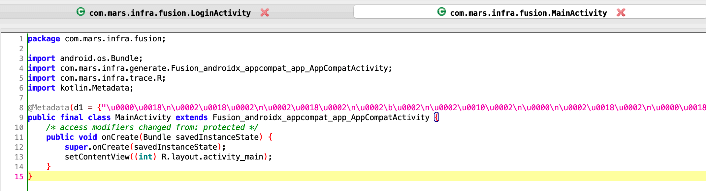
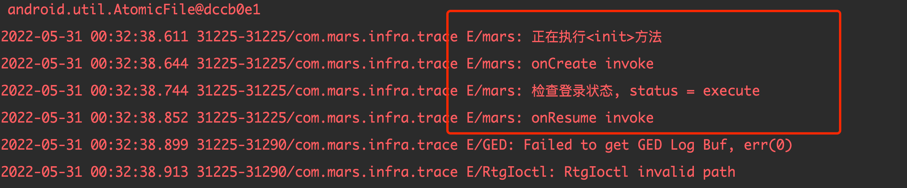

# Fusion     
### 概述        
1. 框架的目的：combine Kotlin or Java Classes into a single Class as the parent class of a class（将多个类组合成一个类，该类作为某个类的父类）           
2. 想法来源：
   1. 打印某些类的日志或埋点上报，例如：打印Activity的生命周期或者某些View的点击事件，作为链路追踪        
   2. [Mixin](https://github.com/bennyhuo/Mixin)，该框架利用APT合并多个类

### 使用效果        
1、创建`FusionLogActivity`，该类不会被打进apk          

```kotlin
@Fusion(target = AppCompatActivity::class)
class FusionLogActivity : AppCompatActivity() {

    override fun onCreate(savedInstanceState: Bundle?) {
        super.onCreate(savedInstanceState)
        Log.e("mars", "onCreate invoke")
        execute()
    }


    override fun onResume() {
        super.onResume()
        Log.e("mars", "onResume invoke")
    }


    override fun onDestroy() {
        super.onDestroy()
        Log.e("mars", "onDestroy invoke")
    }

    private fun execute() {
        Thread.sleep(100)
        checkLoginStatus("execute")
    }

    protected fun action() {
        val t = Thread { println("打印一条语句：action") }
        t.start()
    }

    private fun checkLoginStatus(status: String) {
        Log.e("mars", "检查登录状态, status = $status")
    }
}
```          

2、利用ASM生成新的类`Fusion_androidx_appcompat_app_AppCompatActivity`，作为直接继承`AppCompatActivity`的类的新父类       


3、效果       

- MainActivity反编译代码

- MainActivity的日志打印


### TODO   
- [ ] 组合多个类
- [ ] 处理字段